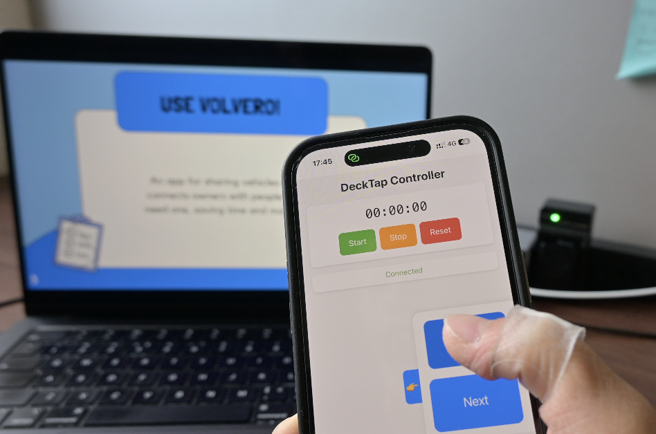
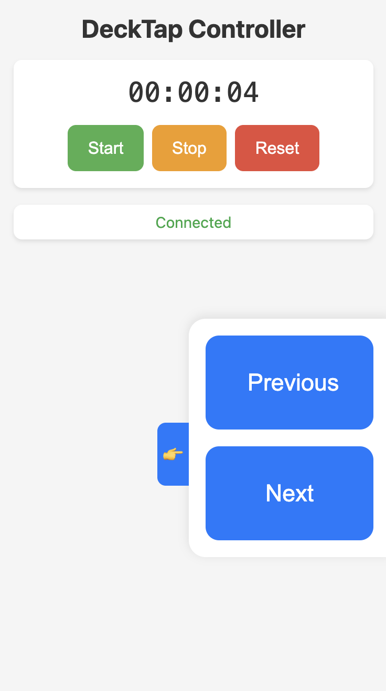
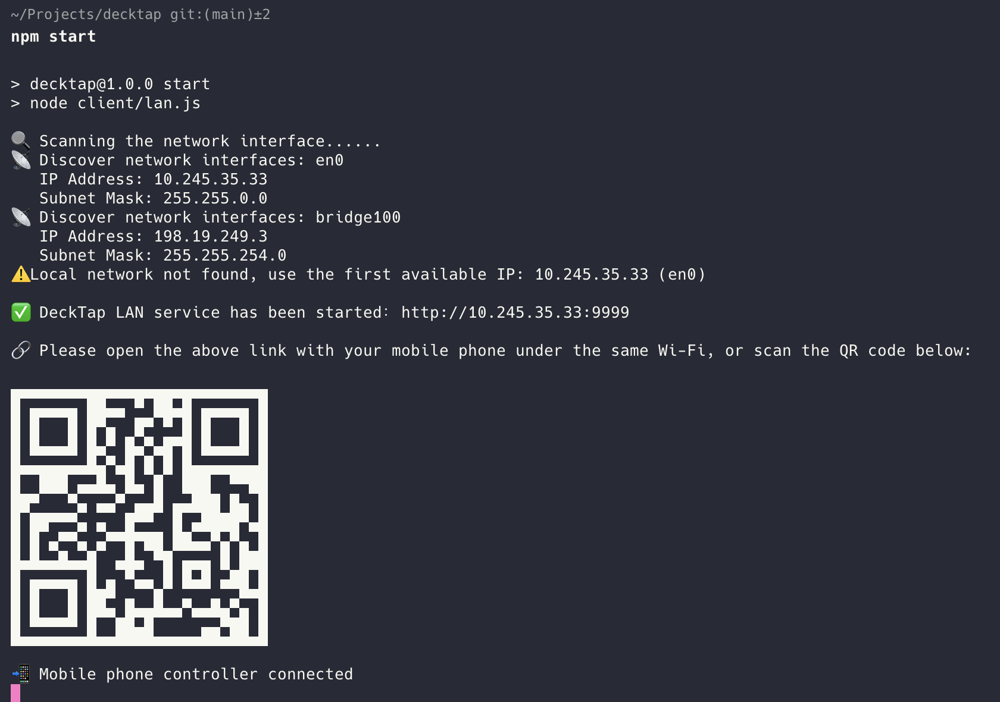

# DeckTap

<p align="center">
  
</p>

**DeckTap 是一个局域网演示遥控器。** 在电脑上运行桌面客户端，用手机连接同一个 Wi-Fi 或热点，扫码并输入数字配对码后，就能直接在手机浏览器里控制 PowerPoint、Keynote、WPS、ProPresenter、极演投影、PDF 放映或其他演示窗口。

手机不需要安装 App，控制数据不经过云端。DeckTap 的重点是：连接快、权限清楚、误触风险低，适合会议室、课堂、路演、小型活动和临时演示。

[下载最新版](https://github.com/SIkenr/decktap/releases) · [更新记录](./CHANGELOG.md) · [测试包说明](./docs/TEST-BUILDS.md)

> 当前版本：**1.0.6**。现阶段提供的是未签名测试包，请只在自己控制的电脑和可信私人网络中使用。

## 亮点

- **手机浏览器即遥控器**：扫码打开控制页，不用给手机安装任何应用。
- **局域网直连**：电脑和手机在同一 Wi-Fi 或热点内通信，控制流量不上传云端。
- **数字码二次确认**：扫码后还要输入电脑端 6 位数字码，避免同网段误连。
- **演示窗口锁定**：翻页前恢复并验证目标窗口焦点，目标丢失时不会把按键发给其他应用。
- **PowerPoint / WPS 放映保护**：识别放映窗口，避开编辑窗口；放映窗口重开后可自动重新锁定。
- **手机端计时工具**：显示演示计时、电脑同步时间，并支持本地保存计时状态。
- **自定义控制布局**：手机端可调整网络时间、计时器、控制区、状态和设置面板的顺序。
- **桌面端管理**：支持二维码、配对状态、目标选择、设备管理、主题、托盘、开机启动和脱敏日志。

## 界面预览

<p align="center">
  <a href="./images/hero.png">
    
  </a>
</p>

<p align="center">
  <a href="./images/phone-controller.png">
    
  </a>
  &nbsp;&nbsp;
  <a href="./images/computer-client.png">
    
  </a>
</p>

## 下载

| 平台 | 文件 | SHA-256 |
| --- | --- | --- |
| Windows x64 | [`DeckTap-1.0.6-win-x64.zip`](https://github.com/SIkenr/decktap/releases/download/v1.0.6/DeckTap-1.0.6-win-x64.zip) | `1b7a1110ce22fdd7909a579d57ce667c030e27d58840795433b8a5a215dffffd` |
| macOS Apple Silicon | [`DeckTap-1.0.6-mac-arm64.zip`](https://github.com/SIkenr/decktap/releases/download/v1.0.6/DeckTap-1.0.6-mac-arm64.zip) | `5a00e1fcb7100e431c9c901f7b8c408d8fc99700d5db703c0ad5ec229e456a83` |

Release 中同时提供 `.sha256` 校验文件。解压前建议验证：

```bash
shasum -a 256 -c DeckTap-1.0.6-win-x64.zip.sha256
shasum -a 256 -c DeckTap-1.0.6-mac-arm64.zip.sha256
```

## 快速开始

### Windows

1. 下载 `DeckTap-1.0.6-win-x64.zip` 并完整解压。
2. 运行解压目录里的 `DeckTap/decktap.exe`。
3. 如果 SmartScreen 提示风险，请先核对来源和 SHA-256，再选择继续运行。
4. Windows 防火墙询问时，只允许 **专用网络**。

### macOS Apple Silicon

当前 macOS 包未使用 Apple Developer ID 签名，也未经过公证。解压后建议先做临时签名：

```bash
codesign --force --deep --sign - /path/to/DeckTap.app
```

然后右键 `DeckTap.app` 选择 **打开**。首次运行时，在 **系统设置 -> 隐私与安全性 -> 辅助功能** 中允许 DeckTap，并重新启动应用。

### 手机连接

1. 电脑和手机连接同一个可信 Wi-Fi 或手机热点。
2. 在电脑端启动 DeckTap 局域网服务。
3. 手机扫描电脑端二维码。
4. 在手机页面输入电脑端显示的 6 位数字配对码。
5. 配对成功后，手机进入控制页面，即可翻页和计时。

企业、校园或访客网络可能启用客户端隔离，手机会无法访问电脑。遇到连接问题时，建议改用私人路由器或手机热点。

## 支持的演示目标

DeckTap 内置快捷目标：

- Keynote
- Microsoft PowerPoint
- WPS Presentation
- ProPresenter
- 极演投影 / PerfectCast
- 自定义应用

点击预设目标后，DeckTap 会扫描本机窗口。只有一个匹配的放映窗口时会直接锁定；有多个候选时会要求你明确选择。自定义应用会保存稳定识别规则，方便下次快速恢复。

## 安全模型

- 每次启动服务都会生成随机二维码令牌和独立数字配对码。
- 二维码令牌放在 URL Fragment 中，不进入初始 HTTP 请求或 Referrer。
- 配对码有效期为 10 分钟，未认证连接有尝试次数和超时限制。
- 同一时间只保留一台已授权手机；新设备配对后旧设备会被撤销。
- WebSocket 命令会经过类型、大小、状态、频率和允许列表校验。
- Electron 渲染进程不直接暴露文件系统、Shell、网络、原生窗口句柄或进程 ID。
- 日志会过滤令牌、密码、Cookie、Authorization、完整 URL 和敏感路径。

DeckTap 用于可信局域网。当前版本没有为局域网 HTTP/WebSocket 增加 TLS，请勿在公共 Wi-Fi 或不可信网络中使用。

## 从源码运行

环境要求：

- Node.js 18 或更高版本
- npm
- Windows x64 或 macOS
- macOS 需要辅助功能权限

```bash
npm install
npm --prefix decktap-web install
npm start
```

命令行局域网模式：

```bash
npm run build:web
npm run start:cli
```

自定义端口：

```bash
PORT=10000 npm run start:cli
```

## 开发与验证

| 命令 | 用途 |
| --- | --- |
| `npm test` | 运行 Node.js 单元与集成测试 |
| `npm run lint` | 检查手机端代码并执行桌面端 TypeScript 类型检查 |
| `npm run build` | 构建手机端并验证桌面端类型 |
| `npm run verify:prepack` | 运行测试、Lint、构建和打包前检查 |
| `npm run package` | 生成当前平台应用目录 |
| `npm run make` | 生成 Electron Forge 分发包 |
| `npm run verify:package -- <app-path>` | 验证打包后的应用结构和安全配置 |

1.0.6 验证结果：

- `node --test`：94 项通过
- `decktap-web` ESLint：通过
- `decktap-web` Vite build：通过
- 桌面端 TypeScript `--noEmit`：通过

自动化测试不会发送真实键盘事件，也不能替代目标硬件上的启动、权限、焦点、翻页和防火墙验收。

## 项目结构

```text
decktap/
├── client/                  # LAN 服务、配对、日志、键盘和窗口目标控制
├── electron/                # Electron 主进程、Preload 和 IPC
├── desktop/                 # React 桌面管理界面
├── decktap-web/             # React 手机控制页面
├── images/                  # README 截图和宣传图
├── scripts/                 # 打包前与打包后验证脚本
├── test/                    # Node.js 单元和集成测试
├── docs/                    # 测试包和开发说明
├── forge.config.js          # Electron Forge 配置
└── package.json
```

## 测试版限制

- Windows 包没有 Authenticode 签名。
- macOS 包没有 Developer ID 签名或 Apple 公证。
- 当前没有安装器、自动更新或代码签名发布链路。
- 跨平台包仍需在真实 Windows/macOS 设备上验证启动、权限、键盘控制、防火墙、托盘和退出行为。
- PowerPoint/WPS 的播放窗口识别仍建议结合不同 Office/WPS 版本做真机验收。

## 相关文档

- [CHANGELOG.md](./CHANGELOG.md)：中文更新记录
- [docs/TEST-BUILDS.md](./docs/TEST-BUILDS.md)：测试包下载、校验和验收清单
- [docs/LOCAL-DEVELOPMENT.md](./docs/LOCAL-DEVELOPMENT.md)：本地开发环境迁移与恢复
- [LICENSE](./LICENSE)：项目许可证

第三方软件名称、商标和图标归各自权利人所有。DeckTap 仅在本地快捷目标选择器中使用这些图标进行软件识别展示。
